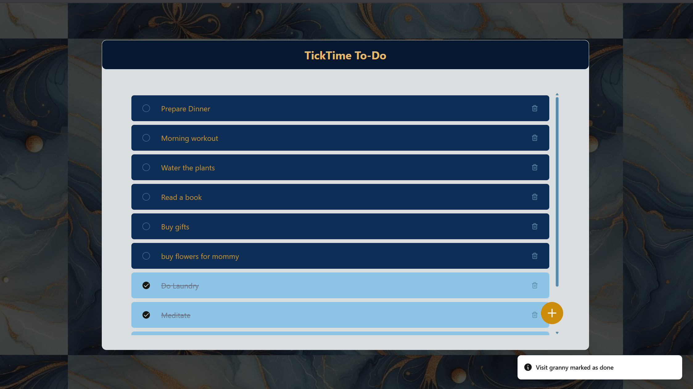

## TickTime To-Do - Frontend

A modern, responsive To-Do application built with React + TypeScript, styled using TailwindCSS, and enhanced with ShadCN UI components.

## Features

-   Add new todos
-   Edit existing todos
-   Mark todos as done
-   Delete todos
-   Sort unchecked → checked
-   Display created/updated timestamps
-   Scrollable list
-   Toast notifications
-   Fully responsive UI
-   Clean and modern layout

## Tech Stack

| Category   | Tools                   |
| ---------- | ----------------------- |
| Framework  | React + TypeScript      |
| Styling    | Tailwind CSS, ShadCN UI |
| Icons      | Lucide React            |
| API        | Axios                   |
| Build Tool | Vite                    |

## Project Structure

frontend/
│── src/
│ ├── api/
│ │ └── todoApi.ts
│ ├── assets/
│ │ └── background.jpg
│ ├── components/
│ │ ├── TodoForm.tsx
│ │ ├── TodoItem.tsx
│ │ └── ui/ (shadcn components)
│ ├── pages/
│ │ └── Home.tsx
│ ├── types/
│ │ └── TodoType.ts
│ └── App.tsx
│ └── main.tsx
│── public/
│── index.html
│── .env
│── package.json
│── tailwind.config.ts
└── README.md

## Installation & Setup

1. Install dependencies
   npm install

2. Create .env file
   VITE_BASE_URL=http://localhost:5000/api/todos

3. Start the dev server
   npm run dev

## API Integration

All API calls are inside:
src/api/todoApi.ts

## Endpoints used:

| Method | Endpoint            | Description                       |
| ------ | ------------------- | --------------------------------- |
| GET    | /api/todos          | Get all TODO items                |
| POST   | /api/todos          | Create a new TODO item            |
| PUT    | /api/todos/:id      | Update a TODO (title/description) |
| PATCH  | /api/todos/:id/done | Toggle the done status            |
| DELETE | /api/todos/:id      | Delete a TODO                     |

## UI Preview

